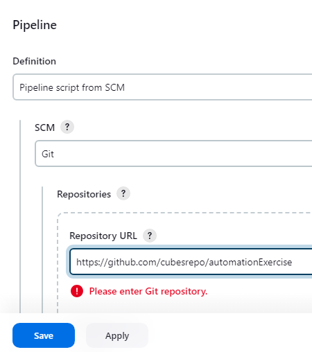
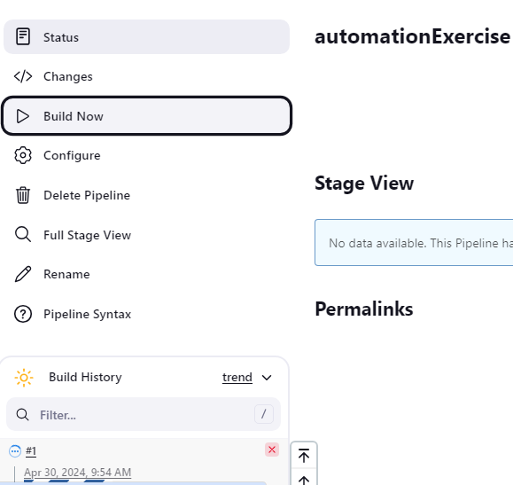

**Hello**🖐 **Automated Testing for automationExercise (E-COMMERCE) Demo Website with (Selenium, Pytest, Page Object Model(POM), Allure Reports, Jenkins Pipeline)**

This project automates the testing of the AutomationExercise demo website, covering critical user workflows such as valid login, signup, adding items to the cart, checkout, adding payment details, and confirming orders.

In addition to the main flows, I tested various edge cases to ensure the system handles unexpected or invalid user actions gracefully. 
These edge cases include:
   - Attempting to register without providing an email or password 
   - Signing up with an email that already exists in the system 
   - Adding multiple quantities of the same product to the cart 
   - Emptying the cart before proceeding to checkout
___________________________________________

🎯 **Pre-requisites:**
- Python 3.11.9
- Any browsers(Chrome, Firefox, Edge)
___________________________________________

▶ **Test Execution**

Run commands: 
1. Install Dependecies:

       pip install -r requirements.txt
2. Run the test with Allure report:

       pytest -v --alluredir=reports/TestCase1
   or specifying browser

       pytest -v --browser=edge --alluredir=reports/TestCase1
    

**To run this on jenkins**
1. Add item name, click Pipeline and click OK
    
    
2. Scroll down and navigate to Pipeline then select "pipeline script from SCM"
    
   
3. Select Git
    
   
4. Paste the Repo URL and click Apply and Save
    
   
5. Click build now
    
   
   

    
   
   
    
